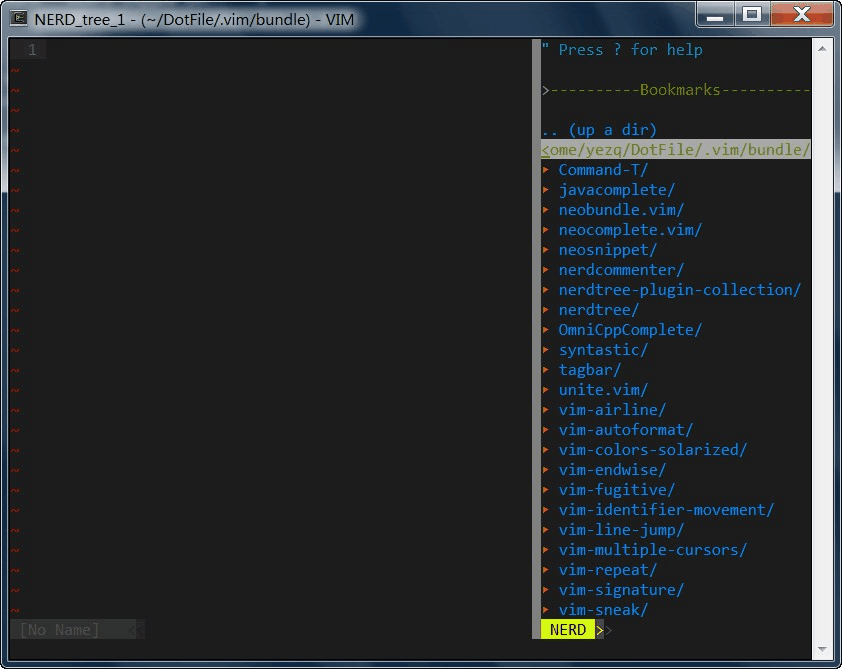

### About
When in Tagbar and NERDTree, It's not convenient jump lines using 'j','k'.
**vim-line-jump** is written to make it easier

### Demo


vim command squence are "fs" and "fn;;;"

### .vimrc setting

    "default g:NERDTreeMapToggleFilters key map is 'f', change it to some key else.
    let g:NERDTreeMapToggleFilters="0"

    "LineJump NERDTree key map
	augroup LineJumpNerdTree
		autocmd BufEnter NERD_tree_\d\+ nnoremap <buffer> <nowait> <silent> f <ESC>:silent! call LineJumpSelectForward()<cr>
		autocmd BufEnter NERD_tree_\d\+ nnoremap <buffer> <nowait> <silent> ; <ESC>:silent! call LineJumpMoveForward()<cr>
		autocmd BufEnter NERD_tree_\d\+ nnoremap <buffer> <nowait> <silent> b <ESC>:silent! call LineJumpSelectBackward()<cr>
		autocmd BufEnter NERD_tree_\d\+ nnoremap <buffer> <nowait> <silent> , <ESC>:silent! call LineJumpMoveBackward()<cr>
		autocmd BufEnter NERD_tree_\d\+ nnoremap <buffer> <nowait> <silent> gh <ESC>:silent! call LineJumpMoveTop()<cr>
		autocmd BufEnter NERD_tree_\d\+ nnoremap <buffer> <nowait> <silent> gm <ESC>:silent! call LineJumpMoveMiddle()<cr>
		autocmd BufEnter NERD_tree_\d\+ nnoremap <buffer> <nowait> <silent> gl <ESC>:silent! call LineJumpMoveBottom()<cr>
	augroup END

	augroup LineJumpTagbar
		autocmd BufEnter __Tagbar__ nnoremap <buffer> <nowait> <silent> f <ESC>:silent! call LineJumpSelectForward()<cr>
		autocmd BufEnter __Tagbar__ nnoremap <buffer> <nowait> <silent> ; <ESC>:silent! call LineJumpMoveForward()<cr>
		autocmd BufEnter __Tagbar__ nnoremap <buffer> <nowait> <silent> b <ESC>:silent! call LineJumpSelectBackward()<cr>
		autocmd BufEnter __Tagbar__ nnoremap <buffer> <nowait> <silent> , <ESC>:silent! call LineJumpMoveBackward()<cr>
		autocmd BufEnter __Tagbar__ nnoremap <buffer> <nowait> <silent> gh <ESC>:silent! call LineJumpMoveTop()<cr>
		autocmd BufEnter __Tagbar__ nnoremap <buffer> <nowait> <silent> gm <ESC>:silent! call LineJumpMoveMiddle()<cr>
		autocmd BufEnter __Tagbar__ nnoremap <buffer> <nowait> <silent> gl <ESC>:silent! call LineJumpMoveBottom()<cr>
	augroup END


## Global option:
### ```g:LineJumpSelectIgnoreCase```
ignore case when select,default is 0, case sensitive
set to 1 to ignore case when select.

### ```g:LineJumpSelectSmartCase```
enable smart case when select, defualt is 0, disabled,
set to 1 to enable smart case when select,
if set to 1, this option overides g:LineJumpSelectIgnoreCase

### ```g:LineJumpSelectMethod```
define sub select way, default is 0
0: sub select by LineJumpSubForward(), LineJumpSubBackward() need to map these two functions to some key
1: sub select by press number and alpha

### ```g:LineJumpSelectInVisable```
only valid when g:LineJumpSelectMethod == 0, 
if it is not 0, select just lines visabled in the window
default is 0, select will scan the whole buffer

### ```g:LineJumpMoveHighlight```
only valid when g:LineJumpSelectMethod == 0, 
if it is not 0, when move using ';',',', the candidate lines will be highlighted
default is 0, the candidate lines will not be highlighted

